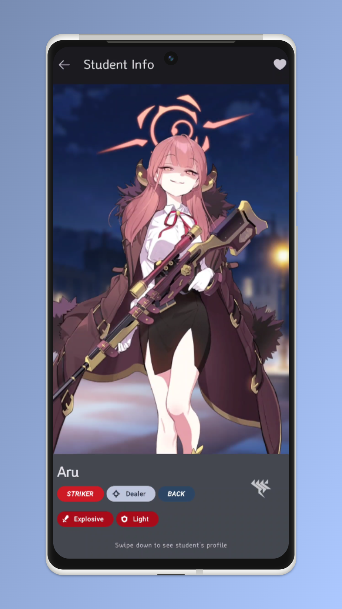
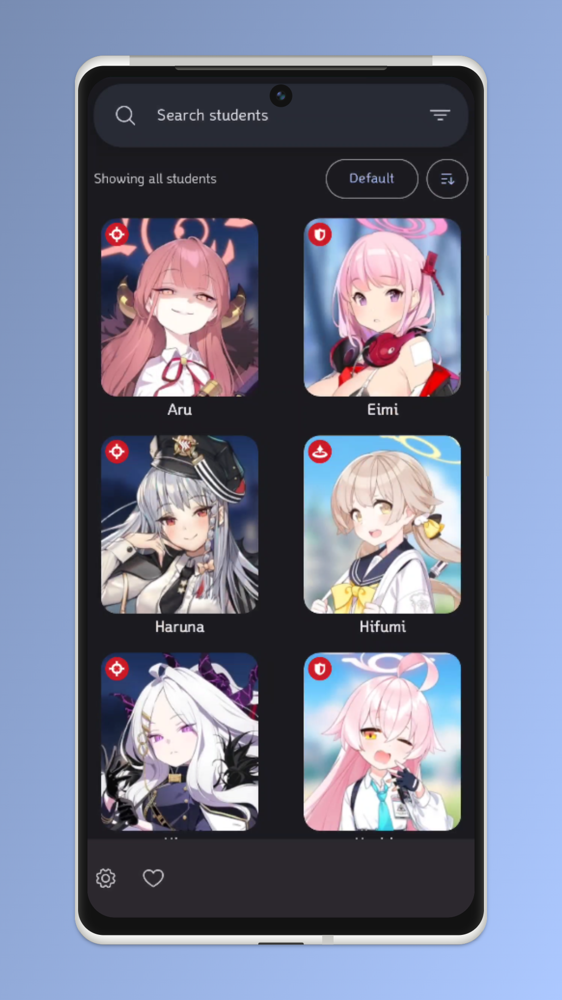
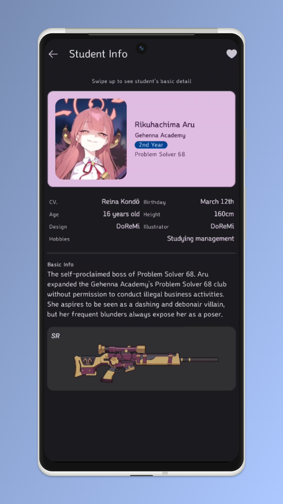

[](https://github.com/alvarodwi/studentprofiles/actions/workflows/Build.yml)
[](https://github.com/alvarodwi/studentprofiles/releases/latest)
[](https://www.codefactor.io/repository/github/alvarodwi/studentprofiles)

<p align="center">
    
</p>
<h1 align="center">StudentProfiles</h1>
<p align="center">View Blue Archive student roster on your phone!</p>

## Build it yourself

This project is built using Gradle. You can either use `./gradlew build` or you can just open this project inside an Android Studio via `Import Project` option.

Before you start, create a `secrets.properties` file that will be used to store sensitive data such as credentials or passphrases that are being used in building this project.

You can refer to `secrets.defaults.properties` to see the full list of secrets you need to fill in.

```kotlin
DB_PASSPHRASE = "<PASSPHRASE FOR DATABASE ENCRYPTION>"
```

## Demo
<div align="center">



</div>
